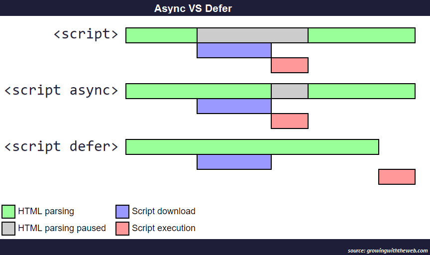

# Critical render path

## Javascript

js is parser blocking, and can access and change both DOM and CSSOM.

1. once a script tag in the HTML is discovered the DOM construction is paused and the script is requested from the server.
1. after the script is loaded, it can't be executed until the CSS above is fetched, as well as the CSSOM is constructed.
1. after the CSSOM is constructed, js is executed. js may access the DOM and the CSSOM and may alter it.

browser will do the above for every script tag.

after all these are done, the browser will create render tree, layout, and then paint

to optimize

- load scripts asynchronously
- defer loading of scripts
- minimize DOM manipulation
- avoid long running js

### Asynchronous and defer loading



- async property

  - behavior
    - browser will download the js with another thread (does not block parsing)
    - once the js is downloaded, it'll execute the it and it will block the parser
  - the execution time of js is not predictable, which means we don't know what elements parsed currently
  - rules: add it when
    - the script doesn't effect the DOM and CSSOM
    - the script doesn't need to know our code
    - the script that is not essential to the user experience
  - examples: google analytics or tracking scripts

- defer property
  - behavior
    - browser will download the js with another thread (does not block parsing)
    - once the js is downloaded, it'll wait until the HTML has been parsed to execute
  - it is good for scripts that will act on DOM, but also not import for loading the above the fold content, which is for improving the performance.
  - use it when the script is not important (e.g. not above the fold)

### Minimize DOM manipulation

remove unnecessary DOM manipulation

for example

```html
<h1>unnecessary color set by js</h1>
<script>
  const h1 = document.querySelector("h1");
  // because js is executed before the render tree, this will always be olive when rendering
  h1.style.color = "olive";
</script>
```

### Avoid long running js

because js is single threaded, long running js code will make the page froze, which means the user can do nothing.

```javascript
const button = document.querySelector("button");
button.addEventListener("click", () => {
  alert("fake long running js"); // this will block the UI
});
```
